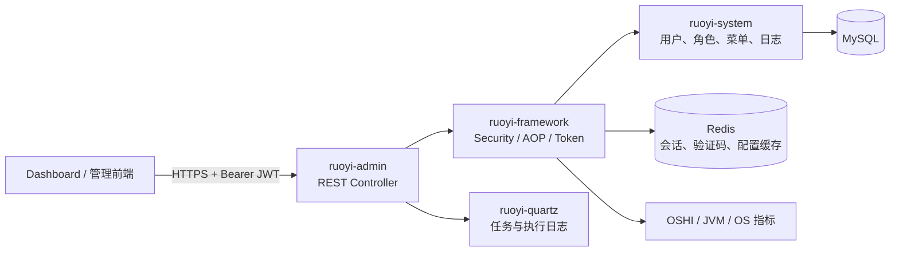
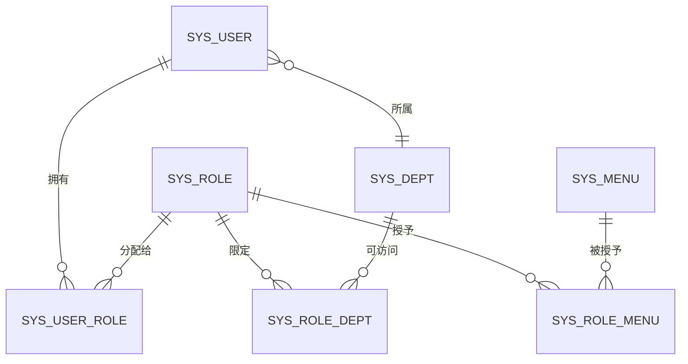

# 权限控制、审计记录与监控 Dashboard 技术设计文档

## 1. 文档目的与范围

本文描述本项目的权限控制、操作/登录审计与系统监控能力的技术设计，适用于管理后台 Dashboard 的后端实现和前端接入。设计以仓库当前代码为事实依据：后端为 RuoYi 3.9.2 的多模块 Spring Boot 应用；前端路由配置虽已写入初始化 SQL，但本仓库未包含 `ruoyi-ui` 源码。因此，本文中的 Dashboard 页面为基于现有 REST API 的接入设计，不将其误记为当前已交付的前端页面。

核心目标：

- 以“用户—角色—菜单/按钮权限—数据范围”实现最小授权；
- 对登录、关键业务操作、异常与管理动作保留可检索的审计证据；
- 展示服务器、Redis、在线会话和定时任务的运行状态；
- 使权限变更、强制退出、日志导出和缓存清理等高风险操作可控、可追溯。

## 2. 总体架构

模块职责如下。

| 模块 | 职责 |
| --- | --- |
| `ruoyi-admin` | 应用启动与 Web 接入；系统管理、登录与监控 Controller。 |
| `ruoyi-framework` | Spring Security、JWT/Redis 会话、AOP 审计、数据范围、限流与基础 Web 配置。 |
| `ruoyi-system` | 用户、角色、菜单、部门、字典、配置、日志等领域模型、服务与 MyBatis Mapper。 |
| `ruoyi-quartz` | Quartz 任务定义、调度、任务执行日志。 |
| `ruoyi-common` | 注解、枚举、通用响应、异常、Redis/Excel/安全工具。 |
| MySQL | 权限主数据、审计日志、任务配置及任务日志。 |
| Redis | 登录态、验证码、密码错误次数、防重与限流等短生命周期数据。 |

## 3. 权限设计

### 3.1 权限模型

系统采用 RBAC，并补充部门维度的数据权限。

- `sys_user`：账号、BCrypt 密码散列、状态、所属部门、最近登录信息。
- `sys_role`：角色编码、状态与数据范围（全部、自定义部门、本部门、本部门及下级、仅本人）。
- `sys_menu`：目录（M）、菜单（C）、按钮/接口权限（F）；`perms` 存放如 `monitor:operlog:export` 的权限标识。
- `sys_user_role`、`sys_role_menu`、`sys_role_dept`：分别维护用户角色、角色功能、角色可见部门的多对多关系。

超级管理员通过受保护的超级管理员角色获得 `*:*:*`，绕过功能和数据范围限制；业务角色必须显式授权。不得再通过固定用户 ID 判断超级管理员。

### 3.2 认证与会话链路

1. 客户端提交账号、密码和 Google Authenticator TOTP 动态码至 `/login`。
2. `SysLoginService` 校验账号/密码、TOTP、IP 黑名单，并委托 Spring Security 的 `AuthenticationManager` 做身份校验。
3. 密码以 BCrypt 散列存储和验证；成功/失败登录均通过异步任务写入 `sys_logininfor`。
4. `TokenService` 为认证成功用户生成随机 UUID，会话信息写入服务端会话缓存；JWT 只签入 UUID 与用户名。
5. 客户端后续以 `Authorization: Bearer <JWT>` 请求。`JwtAuthenticationTokenFilter` 从 JWT 提取 UUID、读取会话、再从 PostgreSQL 重新加载用户、角色和权限后写入 `SecurityContext`，并在距失效 20 分钟内续期。
6. `/logout` 或在线用户强退时删除对应 Redis `login_tokens:<uuid>`，令 JWT 即时失效。

默认 Token 有效期为 30 分钟。生产环境必须将 `token.secret`、数据库密码和 Redis 密码迁移至环境变量或密钥管理服务，禁止保留示例配置。

### 3.3 授权与数据范围

接口层通过 `@PreAuthorize("@ss.hasPermi('xxx')")` 实施功能授权，例如：

| 能力 | 权限标识 | 主要接口 |
| --- | --- | --- |
| 服务器监控 | `monitor:server:list` | `GET /monitor/server` |
| 操作日志查询/导出/删除 | `monitor:operlog:list/export/remove` | `/monitor/operlog/**` |
| 登录日志查询/导出/删除/解锁 | `monitor:logininfor:list/export/remove/unlock` | `/monitor/logininfor/**` |
| 在线用户查询/强退 | `monitor:online:list/forceLogout` | `/monitor/online/**` |
| 缓存监控与清理 | `monitor:cache:list` | `/monitor/cache/**` |
| 任务管理 | `monitor:job:*` | `/monitor/job/**` |

`DataScopeAspect` 在带 `@DataScope` 的业务查询前，按角色把允许范围组装到 `BaseEntity.params.dataScope`，由 Mapper SQL 安全地拼接为过滤条件。新业务查询必须同时完成三件事：定义按钮权限、加 `@PreAuthorize`、在涉及人员/部门数据时加 `@DataScope` 并在 Mapper 使用 `${params.dataScope}`。不得只在前端隐藏按钮。

权限不作为会话缓存的可信来源。每次已认证请求都会从 PostgreSQL 重新加载用户、角色和菜单权限，因此角色停用、用户禁用、角色授权和权限撤销在下一次请求立即生效；会话缓存只用于识别 Token，不用于决定授权结果。

## 4. 审计设计

### 4.1 操作日志

在 Controller 方法上添加 `@Log` 即可纳入审计。`LogAspect` 在执行前记录开始时间，在正常返回或抛出异常后构造 `SysOperLog`，通过 `AsyncManager` 异步持久化，避免审计 I/O 阻塞主请求。

记录字段包括：模块标题、业务类型、Java 方法、HTTP 方法、操作者/部门、URL、IP、请求参数、响应摘要、成功/失败状态、错误信息、操作时间和耗时。密码及确认密码字段被过滤；请求与响应参数各限制为 2,000 字符。

`sys_oper_log` 已具备业务类型、状态和操作时间索引，支持按时间、类型、状态筛选、Excel 导出、按 ID 删除与清空。对清空日志操作本身也会产生操作日志；合规环境建议禁止物理清空，改为保留策略和归档。

### 4.2 登录审计

`SysLoginService` 对验证码失效、密码错误、认证异常与成功登录均调用 `AsyncFactory.recordLogininfor`。`sys_logininfor` 保存账户、IP、归属地、浏览器、操作系统、成功/失败状态、结果消息和时间，并对状态、登录时间建立索引。

登录失败次数由 Redis 的密码错误计数键控制，达到 `user.password.maxRetryCount` 后锁定一段时间（默认 5 次、10 分钟）。监控端的账户解锁接口仅清理这一 Redis 计数，不修改用户状态。

### 4.3 审计边界与改进建议

- 现状仅记录标注了 `@Log` 的 Controller；所有用户、角色、菜单、配置、任务、缓存和导出等敏感写操作必须检查注解覆盖率。
- 日志参数可能包含业务敏感信息。除当前密码字段外，应按领域配置脱敏字段，例如手机号、身份证、访问令牌和附件 URL。
- 日志记录采用异步写入，极端故障时可能丢失少量记录。对强合规场景可引入消息队列/WORM 对象存储及失败重试。
- 建议按“在线 90 天、归档 1 年、销毁留痕”的策略分表或转储，并为高频检索增加 `(oper_time, status)` 等联合索引。

## 5. 监控 Dashboard 设计

Dashboard 以只读状态总览为首页，按权限显示下列卡片与下钻入口。

| 页面/卡片 | 数据来源 | 刷新建议 | 操作权限 |
| --- | --- | --- | --- |
| 服务器资源 | `GET /monitor/server`，OSHI 采集 CPU、内存、JVM、系统与磁盘 | 30–60 秒轮询 | `monitor:server:list` |
| Redis 概览 | `GET /monitor/cache`，含 INFO、DB 大小、命令统计 | 30–60 秒轮询 | `monitor:cache:list` |
| 在线用户 | `GET /monitor/online/list`，Redis `login_tokens:*` | 30 秒轮询 | `monitor:online:list` |
| 操作审计 | `GET /monitor/operlog/list` | 手动筛选/刷新 | `monitor:operlog:list` |
| 登录审计 | `GET /monitor/logininfor/list` | 手动筛选/刷新 | `monitor:logininfor:list` |
| 定时任务 | `/monitor/job` 与 `/monitor/jobLog` | 60 秒或手动 | `monitor:job:*` |

前端应使用后端返回的权限集合控制路由、菜单与按钮渲染，但所有真实安全边界仍由后端 `@PreAuthorize` 保证。监控首页应避免直接返回全部 Redis 键和值；“缓存列表/详情/清理”应作为受限二级页面，并对 `clearCacheAll` 增加二次确认、操作理由与高危审计标记。

建议的告警阈值：CPU 连续 5 分钟 > 85%、JVM 堆使用率 > 80%、磁盘使用率 > 85%、Redis 内存接近 `maxmemory`、登录失败数 5 分钟内异常增长、任务失败连续 3 次。现有代码提供指标查询与任务日志，但尚未提供告警规则、通知通道或时序指标存储；这些属于后续建设范围。

## 6. 关键接口与数据约定

所有接口使用统一 JSON 响应；分页列表通过 `BaseController.startPage()` 和 PageHelper 返回 `TableDataInfo`。导出接口返回 Excel 文件流。

| 方法 | 接口 | 用途 |
| --- | --- | --- |
| GET | `/monitor/server` | 获取宿主机、JVM、内存、磁盘指标。 |
| GET | `/monitor/cache` | 获取 Redis INFO、DB 大小、命令调用统计。 |
| GET | `/monitor/online/list?ipaddr=&userName=` | 查询 Redis 会话形成的在线用户列表。 |
| DELETE | `/monitor/online/{tokenId}` | 强制指定会话下线。 |
| GET | `/monitor/operlog/list` | 分页查询操作日志。 |
| POST | `/monitor/operlog/export` | 导出操作日志。 |
| DELETE | `/monitor/operlog/{operIds}`、`/clean` | 删除或清理操作日志。 |
| GET | `/monitor/logininfor/list` | 分页查询登录记录。 |
| GET | `/monitor/logininfor/unlock/{userName}` | 清除用户登录错误计数。 |
| GET/DELETE | `/monitor/cache/**` | 查询缓存命名空间、键/值，或清理缓存。 |

## 7. 非功能设计与上线要求

安全：生产环境启用 TLS，禁用或严格限制 Swagger 和 Druid 控制台，配置 CORS 白名单；JWT 密钥不入库、不入 Git；管理监控接口按最小权限分配，特别限制导出、清空、强退与缓存清理。

性能：日志写入使用异步线程池；列表必须分页；大体量日志导出应改为异步任务和下载中心；Redis `keys(pattern)` 在大 keyspace 下会阻塞，应在生产替换为 SCAN 游标遍历或维护在线会话索引。

可用性：应用应配置健康检查、MySQL/Redis 连接池告警、日志轮转与数据库备份。单机 Quartz 的任务状态适合单实例；多实例部署需明确 Quartz 集群、任务幂等和防并发策略。

可观测性：应用日志应输出 request-id；监控指标应接入 Prometheus/OpenTelemetry 等时序与链路体系，Dashboard 只承担运营可视化，不替代基础设施监控平台。

## 8. 验收标准

1. 无 Token 访问受保护接口返回 401；无对应权限返回 403。
2. 用户拥有多个角色时，权限为有效角色权限并集；数据查询严格符合角色数据范围。
3. 登录成功、失败、验证码失败和账户解锁均可在登录日志中查询到或被审计。
4. 标注 `@Log` 的成功与异常操作均产生操作日志，且密码字段不落库。
5. 在线用户强退后，该 Token 不能再访问受保护接口。
6. Dashboard 的卡片数据与 `/monitor/server`、`/monitor/cache`、`/monitor/online/list` 返回结果一致；无权限用户看不到且无法调用高危操作。
7. 日志查询、导出、清理和缓存清理均经过权限校验，并产生相应的操作审计记录。
